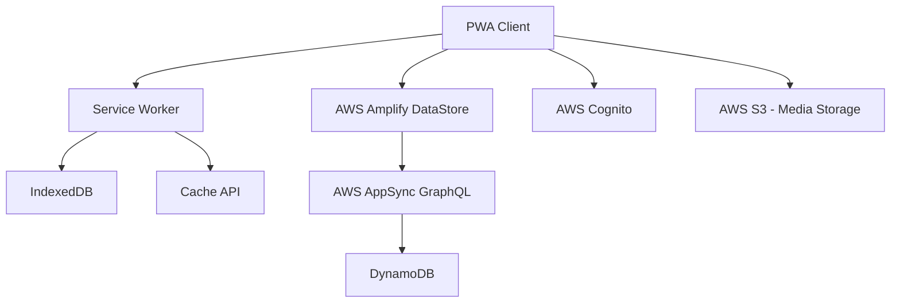
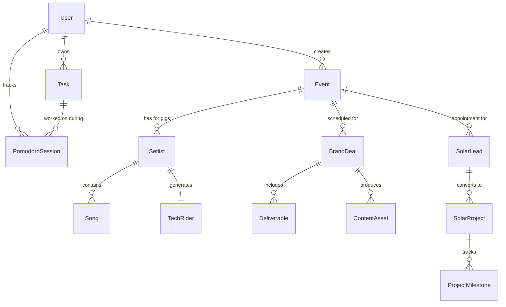

# Design Document: MEUGRIND Productivity System

## Overview

MEUGRIND is an offline-first Progressive Web Application designed for a multi-hyphenate creative professional operating from rural Brazil with intermittent internet connectivity. The system supports four distinct professional roles through a unified interface that adapts to context and connectivity constraints.

The architecture prioritizes local-first data storage with intelligent synchronization, role-based access control, and dynamic interface adaptation. The system must function seamlessly offline while providing enterprise-grade features for managing complex creative and business operations.

## Architecture

### High-Level Architecture Pattern

The system follows a **Local-First Architecture** with the following key principles:

1. **Client-Centric Data Storage**: Primary data lives on the client device using IndexedDB
2. **Optimistic UI Updates**: All user actions render immediately before persistence confirmation
3. **Background Synchronization**: Delta sync with conflict resolution when connectivity is available
4. **Progressive Enhancement**: Core functionality works offline, enhanced features require connectivity

### Technology Stack

| Component | Technology | Rationale |
|-----------|------------|-----------|
| Frontend Framework | Next.js 14 with React 18 | PWA support, SSR/SSG capabilities, robust ecosystem |
| Local Database | IndexedDB with Dexie.js | Browser-native storage, reactive queries, offline-first |
| Remote Sync | AWS Amplify DataStore | Managed sync service, conflict resolution, real-time updates |
| UI Library | Shadcn/UI + Tailwind CSS | Lightweight, customizable, supports dynamic theming |
| State Management | Zustand + TanStack Query | Simple state management, server state caching |
| Drag & Drop | @dnd-kit/core | Modern, accessible drag-and-drop for Kanban boards |
| Authentication | AWS Cognito | Role-based access, secure token management |
| Notifications | Web Push API | Background notifications, focus mode integration |

### Deployment Architecture



## Components and Interfaces

### Core System Components

#### 1. Authentication & Role Management
```typescript
interface User {
  id: string;
  email: string;
  role: 'manager' | 'personal';
  permissions: Permission[];
  preferences: UserPreferences;
}

interface Permission {
  resource: string;
  actions: ('read' | 'write' | 'delete')[];
}
```

#### 2. Offline-First Data Layer
```typescript
interface SyncableEntity {
  id: string;
  createdAt: Date;
  updatedAt: Date;
  syncStatus: 'synced' | 'pending' | 'conflict';
  version: number;
}

interface SyncQueue {
  id: string;
  entityType: string;
  entityId: string;
  operation: 'create' | 'update' | 'delete';
  data: any;
  timestamp: Date;
  retryCount: number;
}
```

#### 3. Dynamic Interface System
```typescript
interface InterfaceContext {
  mode: 'manager' | 'personal' | 'performance';
  deviceType: 'mobile' | 'tablet' | 'desktop';
  connectivity: 'online' | 'offline' | 'limited';
  batteryLevel?: number;
  location?: GeolocationCoordinates;
}

interface AdaptiveComponent {
  render(context: InterfaceContext): ReactElement;
  getLayoutConfig(context: InterfaceContext): LayoutConfig;
}
```

### Module-Specific Components

#### Band Management Module
```typescript
interface Song {
  id: string;
  title: string;
  key: string;
  bpm: number;
  duration: number;
  techRequirements: TechRequirement[];
}

interface Setlist extends SyncableEntity {
  name: string;
  songs: Song[];
  gigId?: string;
  notes: string;
}

interface TechRider {
  id: string;
  setlistId: string;
  inputList: AudioInput[];
  stagePlot: string; // Base64 image or URL
  specialRequirements: string[];
}
```

#### Influencer CRM Module
```typescript
interface BrandDeal extends SyncableEntity {
  brandName: string;
  campaignName: string;
  status: 'pitch' | 'contract' | 'content' | 'posted' | 'paid';
  deliverables: Deliverable[];
  exclusivityClauses: string[];
  fee: number;
  deadline: Date;
}

interface ContentAsset {
  id: string;
  type: 'story' | 'post' | 'reel';
  metrics: {
    views: number;
    engagement: number;
    timestamp: Date;
  };
  mediaUrl?: string;
}
```

#### Solar CRM Module
```typescript
interface SolarLead extends SyncableEntity {
  contactInfo: ContactInfo;
  propertyType: 'domestic' | 'commercial';
  energyRequirements: EnergyRequirements;
  status: 'lead' | 'qualified' | 'assessment' | 'proposal' | 'contract' | 'installation' | 'customer';
  followupDate: Date;
  notes: string[];
}

interface SolarProject {
  id: string;
  customerId: string;
  systemSize: number;
  installationDate: Date;
  permitStatus: 'pending' | 'approved' | 'rejected';
  timeline: ProjectMilestone[];
}
```

#### Pomodoro Timer Module
```typescript
interface PomodoroSession extends SyncableEntity {
  duration: number; // minutes
  breakDuration: number; // minutes
  projectId?: string;
  taskCategory: string;
  startTime: Date;
  endTime?: Date;
  completed: boolean;
  notes?: string;
}

interface FocusMode {
  isActive: boolean;
  sessionId: string;
  suppressNotifications: boolean;
  blockedApps?: string[];
}
```

## Data Models

### Core Entity Relationships



### Database Schema Design

The local IndexedDB will contain the following object stores:

1. **users** - User profiles and preferences
2. **events** - Calendar events across all modules
3. **tasks** - Action items and todos
4. **songs** - Music repertoire database
5. **setlists** - Performance song lists
6. **brand_deals** - Influencer campaigns
7. **content_assets** - Media and metrics
8. **solar_leads** - CRM prospects and customers
9. **solar_projects** - Installation projects
10. **pomodoro_sessions** - Time tracking data
11. **sync_queue** - Pending synchronization operations
12. **conflicts** - Data conflicts requiring resolution

### Sync Strategy

The system implements a **Delta Sync** pattern with the following characteristics:

- **Optimistic Updates**: Changes applied locally immediately
- **Batch Synchronization**: Multiple changes sent in single requests
- **Conflict Resolution**: Last-write-wins for simple fields, manual merge for complex data
- **Retry Logic**: Exponential backoff for failed sync attempts
- **Bandwidth Optimization**: Only changed fields synchronized

## Correctness Properties

*A property is a characteristic or behavior that should hold true across all valid executions of a system—essentially, a formal statement about what the system should do. Properties serve as the bridge between human-readable specifications and machine-verifiable correctness guarantees.*

Based on the prework analysis, the following correctness properties have been identified from the testable acceptance criteria:

### Property Reflection

After reviewing all properties identified in the prework, I've identified several areas where properties can be consolidated:

- Properties 1.2, 7.5, and 8.3 all relate to local functionality remaining available - these can be combined into a comprehensive "local operations availability" property
- Properties 1.4, 7.2, and 7.3 all relate to conflict handling - these can be combined into a single conflict resolution property
- Properties 2.2 and 2.3 both relate to role-based access control - these can be combined into a comprehensive access control property
- Properties 8.1, 8.2, and 8.5 all relate to resource optimization - these can be combined into a resource management property

### Core System Properties

**Property 1: Offline CRUD Operations**
*For any* core data entity and any CRUD operation, the system should function completely offline without requiring network connectivity
**Validates: Requirements 1.2, 7.5, 8.3**

**Property 2: Automatic Sync Initiation**
*For any* connectivity state change from offline to online, the system should automatically initiate background synchronization
**Validates: Requirements 1.3**

**Property 3: Comprehensive Conflict Resolution**
*For any* synchronization conflict, the system should preserve both data versions, implement appropriate resolution strategy (last-write-wins for simple fields, manual merge for complex documents), and alert the Manager account for manual resolution
**Validates: Requirements 1.4, 7.2, 7.3**

**Property 4: Optimistic UI Updates**
*For any* user action, the UI should render changes immediately before persistence confirmation
**Validates: Requirements 1.5**

**Property 5: Power Management**
*For any* device with battery below 20%, the system should enter eco mode, reduce animations, and pause non-essential background processes
**Validates: Requirements 1.6, 8.2**

**Property 6: Role-Based Access Control**
*For any* authenticated user, the system should enforce access permissions based on their role - Manager accounts should have full access to all modules while Personal accounts should be restricted from sensitive data
**Validates: Requirements 2.2, 2.3**

**Property 7: Event Visibility Control**
*For any* event created by Manager account, the system should allow marking visibility levels and enforce privacy shield restrictions for Personal account
**Validates: Requirements 2.4, 2.5**

### Module-Specific Properties

**Property 8: Song Metadata Display**
*For any* song with key and BPM metadata, the system should display this information prominently when in Performance Mode
**Validates: Requirements 3.2**

**Property 9: Tech Rider Generation**
*For any* finalized setlist, the system should generate a Tech Rider PDF containing specific input lists and stage plots based on the selected songs
**Validates: Requirements 3.3**

**Property 10: Performance Call Sheet Generation**
*For any* confirmed performance with assigned contractors, the system should generate individual call sheets with load-in, sound check, and show times
**Validates: Requirements 3.5**

**Property 11: Brand Deal Task Generation**
*For any* created brand deal, the system should automatically generate appropriate deliverable tasks with associated deadlines
**Validates: Requirements 4.2**

**Property 12: Brand Conflict Detection**
*For any* new brand deal, the system should check against the brand blacklist and warn Manager account of conflicts with existing exclusivity clauses
**Validates: Requirements 4.5**

**Property 13: PR Event Linking**
*For any* scheduled PR event, the system should allow linking wardrobe and styling notes to the calendar entry
**Validates: Requirements 5.3**

**Property 14: Performance Mode Behavior**
*For any* system in Performance Mode, non-critical notifications should be suppressed and setlists should display in high-contrast text
**Validates: Requirements 6.2**

**Property 15: Personal Dashboard Display**
*For any* Personal account home screen, the "My Grind" widget should display exactly the next 3 immediate actions
**Validates: Requirements 6.3**

### Synchronization Properties

**Property 16: Delta Synchronization**
*For any* data change when connectivity is available, the system should upload only the changed fields, not entire records
**Validates: Requirements 7.1**

### Performance and Resource Properties

**Property 17: Comprehensive Resource Management**
*For any* uploaded image, the system should implement compression; for any low storage condition, the system should automatically archive old data while preserving recent entries
**Validates: Requirements 8.1, 8.5**

**Property 18: Data Caching**
*For any* critical data, the system should cache it locally to ensure instant loading of frequently accessed information
**Validates: Requirements 8.4**

### Pomodoro Timer Properties

**Property 19: Pomodoro Session Linking**
*For any* started Pomodoro session, the system should allow linking to a specific project or task category
**Validates: Requirements 9.2**

**Property 20: Pomodoro Session Tracking**
*For any* completed Pomodoro session, the system should track it and display daily/weekly productivity statistics
**Validates: Requirements 9.3**

**Property 21: Focus Mode Notification Suppression**
*For any* active Pomodoro session, the system should suppress non-urgent notifications to maintain focus
**Validates: Requirements 9.4**

**Property 22: Pomodoro Session Completion**
*For any* completed Pomodoro session, the system should automatically log time to the associated project and prompt for session notes
**Validates: Requirements 9.5**

### Solar CRM Properties

**Property 23: Solar Lead Data Capture**
*For any* new solar lead created, the system should capture contact information, property type (domestic/commercial), and energy requirements
**Validates: Requirements 10.3**

**Property 24: Automatic Followup Scheduling**
*For any* solar lead, the system should automatically schedule followup tasks based on lead stage and last contact date
**Validates: Requirements 10.4**

**Property 25: Pipeline Stage Transitions**
*For any* prospect moving between pipeline stages, the system should generate appropriate follow-up actions and document templates
**Validates: Requirements 10.5**

**Property 26: Solar Sales Reporting**
*For any* sales report generation, the system should show conversion rates, pipeline value, and customer acquisition metrics for both domestic and commercial segments
**Validates: Requirements 10.7**

## Error Handling

The system implements comprehensive error handling across all layers:

### Network and Connectivity Errors
- **Connection Loss**: Graceful degradation to offline mode with user notification
- **Sync Failures**: Exponential backoff retry with manual retry option
- **Partial Sync**: Resume from last successful checkpoint
- **Timeout Handling**: Configurable timeouts based on connection quality

### Data Integrity Errors
- **Validation Failures**: Client-side validation with clear error messages
- **Constraint Violations**: Prevent invalid state transitions with user guidance
- **Corruption Detection**: Checksums and data validation on load
- **Recovery Procedures**: Automatic backup restoration for critical data

### Authentication and Authorization Errors
- **Token Expiry**: Automatic refresh with fallback to re-authentication
- **Permission Denied**: Clear messaging with suggested actions
- **Role Conflicts**: Graceful handling of role changes during active sessions
- **Session Management**: Secure session cleanup on errors

### Resource Constraint Errors
- **Storage Full**: Automatic cleanup with user confirmation
- **Memory Pressure**: Lazy loading and data pagination
- **Battery Critical**: Emergency mode with minimal functionality
- **Bandwidth Limits**: Adaptive sync with priority queuing

### User Interface Errors
- **Component Failures**: Error boundaries with fallback UI
- **State Corruption**: Reset to known good state with user notification
- **Navigation Errors**: Breadcrumb recovery and safe navigation
- **Input Validation**: Real-time feedback with correction suggestions

## Testing Strategy

The testing approach combines unit testing for specific examples and property-based testing for universal correctness validation.

### Property-Based Testing Framework

**Technology**: Fast-check (JavaScript property-based testing library)
**Configuration**: Minimum 100 iterations per property test
**Tagging**: Each test tagged with **Feature: meugrind-productivity-system, Property {number}: {property_text}**

### Property Test Implementation

Each correctness property will be implemented as a property-based test:

1. **Data Generation**: Smart generators that create realistic test data within valid input spaces
2. **Property Verification**: Universal quantification testing across generated inputs
3. **Shrinking**: Automatic reduction to minimal failing cases
4. **Regression Testing**: Failed cases become permanent regression tests

### Unit Testing Strategy

**Framework**: Jest with React Testing Library
**Coverage**: Specific examples, edge cases, and integration points
**Focus Areas**:
- Component rendering and interaction
- API integration points
- Error boundary behavior
- Authentication flows
- Offline/online state transitions

### Testing Categories

#### Core System Tests
- Offline CRUD operations across all entity types
- Sync conflict resolution scenarios
- Role-based access control enforcement
- Performance mode behavior validation

#### Module-Specific Tests
- Setlist builder drag-and-drop functionality
- Tech rider PDF generation accuracy
- Brand deal conflict detection
- Solar CRM pipeline transitions
- Pomodoro timer accuracy and session tracking

#### Integration Tests
- End-to-end user workflows
- Cross-module data consistency
- Authentication and authorization flows
- Sync process reliability

#### Performance Tests
- Local operation response times (<200ms requirement)
- Memory usage under various data loads
- Battery consumption in different modes
- Bandwidth efficiency during sync

### Test Data Management

**Generators**: Custom generators for each entity type that respect business rules
**Fixtures**: Realistic test data sets for integration testing
**Cleanup**: Automatic test data cleanup to prevent interference
**Isolation**: Each test runs in isolated environment with fresh data

The dual testing approach ensures both specific functionality works correctly (unit tests) and universal properties hold across all inputs (property tests), providing comprehensive coverage for this complex offline-first system.

<function_calls>
<invoke name="prework">
<parameter name="featureName">meugrind-productivity-system